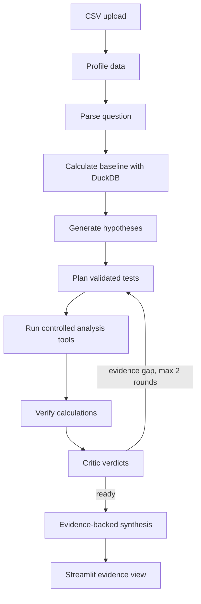

# Argue With My Data

**Most data agents give you an answer. Ours tries to falsify the explanation before it gives you one.**

Hacktoberfest Hack Day — Coimbatore 2026 (INIT CLUB × iDEA CLUB, in collaboration with MLH; event context supplied by the project brief).

## Team

**Team Name:** Training with Vibes

| Member | Contribution |
| --- | --- |
| Krishav JS (Team Leader) | TODO: Add actual contribution. |
| Pranav Senthil | TODO: Add actual contribution. |
| Rahul Srinivasan | TODO: Add actual contribution. |
| Mohal Raj | TODO: Add actual contribution. |

## Problem Statement

CSV analysis tools can return a plausible explanation for a business change without showing whether the explanation fits the data. A confident answer can mistake a small contributor for the main driver or imply causality from a simple comparison.

## Why We Chose This Problem

- AI analysis can sound confident while giving an incorrect explanation; we wanted an analyst that tests its own ideas.
- The most memorable event may explain only a small part of a metric change, so explanations should be measured against the data.
- Users should be able to trace a conclusion through the test and calculation that supports it.
- The system should admit when the available data cannot test a claim, such as seasonality with only two months of history.

## Solution

Argue With My Data profiles an uploaded CSV, parses a business question, calculates a deterministic period baseline, creates competing explanations, runs controlled analysis tools, verifies the calculations, and presents a critic verdict for each explanation. It labels contribution as contribution and does not claim causal proof.

## Key Features

- CSV upload or a built-in adversarial sales example
- Data type, missingness, date range, metric, and dimension profiling
- Gemma question parsing, hypothesis generation, test planning, criticism, and selection of a code-verified supported hypothesis when configured
- Schema-validated model output and a local fallback for keyless development
- DuckDB/Pandas calculations for period comparisons, dimension contribution, product mix, trend, and data quality
- Explicit falsification thresholds, evidence trace, verification checks, and `UNTESTABLE` verdicts
- LangGraph state machine with conditional routing and a bounded iteration count

## Innovation and Differentiation

The system tests competing explanations against inspected evidence. The bundled CSV is a 33-row synthetic monthly aggregate fixture, useful for a controlled trace but not realistic order-level history. Its customer and region labels are illustrative, and its two monthly snapshots cannot test seasonality. The current demo has a customer decoy contributing 8% of the decline, while the measured product unit-mix effect accounts for about 67%. The values below are calculated from the bundled CSV and covered by the test suite.

| Demo check | Calculated evidence | Verdict |
| --- | ---: | --- |
| Revenue, February → March | 10,000,000 → 7,940,000 (-20.6%) | Baseline |
| Departing customer | 8.0% of the net decline | WEAKENED |
| Product unit-mix effect | 66.99% of the net decline | SUPPORTED |
| Largest regional contributions | Seven of eight regions: 14.0% each; remaining region: 2.0% | WEAKENED |
| Data quality | 0% missing values, 0 duplicate rows, no missing months | REJECTED |
| Seasonality | 2 monthly periods; fewer than the 24-month rule | UNTESTABLE |

## Technical Implementation

The LangGraph state contains the question, dataset profile, selected periods and metric, baseline, hypotheses, falsification contracts, deterministic results, verification, verdicts, and final report. Planned tests use only a controlled Python tool registry; model output cannot run generated code.

### Architecture



### Technology Stack

Python 3.11+, LangGraph, LangChain, Gemma via the Google Generative AI LangChain integration, Pandas, DuckDB, NumPy, Pydantic, Streamlit, Plotly, and python-dotenv.

### How It Works

1. The profiler identifies columns, types, dates, numeric measures, dimensions, missingness, and observed months.
2. The question parser selects existing columns and available comparison months.
3. DuckDB calculates the baseline; Pandas-based tools compare groups, evaluate unit-mix shifts, inspect trend history, and check data quality.
4. Pydantic validates hypotheses and falsification contracts before any tool executes.
5. A verifier recomputes the baseline and each planned analysis against the dataset, then compares the full recorded results. The critic assigns `SUPPORTED`, `WEAKENED`, `REJECTED`, or `UNTESTABLE` using the evidence and visible thresholds.
6. The final answer states contribution and uncertainty without asserting causation.

### Technical Decisions

- No vector database, RAG, database server, Docker, or arbitrary model-generated Python is used.
- Gemma can propose hypotheses, challenge them, and select among the already-verified supported hypotheses; code calculates every reported value and composes the final evidence summary.
- If `GEMMA_API_KEY` is absent or a structured response is invalid, the app uses schema-checked local hypotheses and the deterministic question parser. This fallback keeps the demo runnable but does not represent a live Gemma response.
- Product mix is calculated from changes in unit shares valued at the earlier period’s product revenue per unit. That definition is shown with the evidence.

### Implementation During the Hackathon

TODO: Add the actual implementation timeline after the event. No work history is inferred here.

### Team Contributions

TODO: Attribute work to team members.

## Working Application

Run the local Streamlit app with the instructions below. No hosted instance has been configured.

### Live Application

N/A — no live deployment URL is configured.

### Demo Video

TODO: Add a demo recording link.

## Open Source and AI Usage

### AI / Models

Gemma is configured through `GEMMA_MODEL` (default `gemma-4-26b-a4b-it`) and `GEMMA_API_KEY`. It handles question interpretation, competing hypotheses, test planning, critic notes, and selection of a supported hypothesis by ID. Its final synthesis response contains no free-text rationale; Python composes the displayed summary from calculated evidence. Responses are requested as JSON and validated with Pydantic; the integration does not rely on native structured-output mode. Model output never executes code or supplies trusted arithmetic. A live model call was not required for the deterministic demo tests. See Google's [Gemma Gemini API guide](https://ai.google.dev/gemma/docs/core/gemma_on_gemini_api).

### Open Source Components

- LangGraph — investigation state and conditional routing
- LangChain and `langchain-google-genai` — structured model integration
- Pandas and DuckDB — deterministic data processing and aggregation
- NumPy — verification tolerances
- Pydantic — validation of structured plans and verdicts
- Streamlit — application interface
- Plotly — baseline chart
- python-dotenv — local environment configuration

The project uses these dependencies; it does not claim ownership of their code. Consult each package’s published license and include any required notices when distributing a release.

## Setup and Usage

### Prerequisites

- Python 3.11 or newer
- pip
- A Gemma-compatible Google AI Studio API key for live model calls (optional for the deterministic fallback)

### Installation

```powershell
py -3.11 -m venv .venv
.venv\Scripts\Activate.ps1
python -m pip install -r requirements.txt
if (-not (Test-Path .env)) { Copy-Item .env.example .env }
```

### Environment Variables

Set `GEMMA_API_KEY` in `.env` to enable Gemma. `GEMMA_MODEL` can select another compatible Gemma model. Keep `.env` private; it is ignored by Git. `.gitignore` does not exclude files from manually created ZIP archives, so use the project packager below when sharing a source archive.

### Creating a Source Archive

Run this from the project root to create `dist/argue-with-data-source.zip`. It excludes `.env`, virtual environments, caches, and local Streamlit secrets.

```powershell
python package_source.py
```

### Running the Project

```powershell
streamlit run app.py
```

### Usage

Choose **Try the demo dataset** or upload a CSV with a date column and numeric measure. Ask a question such as “Why did revenue fall in March?” and select **Investigate**. Expand a hypothesis to inspect its test, thresholds, raw result, and verdict.

## Challenges and Learnings

- A contribution across a dimension is not automatically a causal explanation.
- A seasonal explanation needs repeated history; this demo contains two monthly periods and therefore marks seasonality `UNTESTABLE`.
- A mix estimate needs both unit quantities and a measure such as revenue; without quantity data the tool reports share shifts and marks a true unit-mix effect unavailable.

## Devpost Submission

TODO: Add the Devpost project URL after submission.

## Credits

Hackathon context and product requirements were supplied in the project brief. AI and open-source components are listed above. TODO: Add any external datasets, contributors, or other references used in the final submission.

## License

TODO: Choose a project license and add the corresponding `LICENSE` file before public release.

## Verification

Run the local checks with:

```powershell
python -m unittest discover -s tests -v
```

The tests cover the bundled dataset’s baseline, each analysis tool, verification, verdicts, and a complete LangGraph invocation when the runtime dependencies are available.

## Submission Checklist

- [x] No API key is stored in the repository.
- [x] The demo’s displayed values come from deterministic calculations.
- [x] Analysis tools are selected from a controlled registry.
- [x] Calculation and full graph tests are included.
- [x] Add team name and member names.
- [x] Explain why the team chose the problem.
- [ ] Add actual team contributions.
- [ ] Add demo video and Devpost links.
- [ ] Choose a license and add its file.
- [ ] Configure a live deployment if one is needed.
