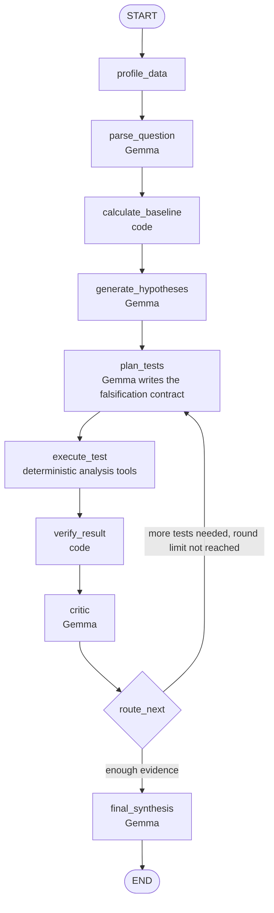

# Argue With My Data

> An AI data investigation agent that tries to falsify its own explanations before it answers. Upload a CSV, ask why a metric changed, and it tests competing explanations with deterministic calculations to show which ones the evidence supports, weakens, rejects or can't test.

## Team

**Team Name:** Training with Vibes


| Member                    | Contribution   |
| ------------------------- | -------------- |
| Krishav JS (Team Leader)  | TODO           |
| Pranav Senthil            | TODO           |
| Rahul Srinivasan          | TODO           |
| Mohal Raj                 | TODO           |


## Problem Statement

### The Problem

When a business metric changes, people ask "why?". AI data assistants are good at producing a plausible answer, such as "revenue fell because a major customer stopped ordering". A plausible answer isn't necessarily correct. A single dramatic event may account for only a small share of a change, while the real driver is spread thinly across the data. Analysts, managers and founders who act on the plausible answer can make the wrong decision.

### Why We Chose This Problem

TODO: the team's reason, in its own words.

## Solution

Argue With My Data treats a "why" question as an investigation instead of a chat. It proposes several competing explanations, defines in advance how each one could be falsified, runs deterministic tests on the data, checks the calculations, has a critic challenge the results, and only then reports which explanations hold up. It also says when an explanation can't be tested with the data available.

### Key Features

- **Competing hypotheses:** several measurable explanations are tested, not just the first plausible one.
- **Falsification contracts:** each hypothesis gets a structured test with explicit, visible thresholds for support and rejection.
- **Deterministic evidence:** aggregations, percentages and contributions are calculated in code, never by the language model.
- **Four verdicts:** SUPPORTED, WEAKENED, REJECTED or UNTESTABLE, with an evidence trace (claim → test → calculation → result → verdict) for each.
- **Causality guardrail:** results are reported as contribution ("accounts for 40% of the decline"), not causation.

## Innovation and Differentiation

Most AI data tools follow CSV → LLM → answer. Argue With My Data puts an adversarial loop between the question and the answer: the model proposes explanations and tests, code computes the evidence, a verification step checks it, and a critic challenges the explanations before any conclusion is given. The system can weaken or reject its own first explanation, and can return UNTESTABLE instead of forcing an answer when the data is insufficient.

## Technical Implementation

### Architecture



### Technology Stack


| Category        | Technologies                                                     |
| --------------- | ---------------------------------------------------------------- |
| Frontend        | Streamlit, Plotly                                                |
| Backend         | Python 3.11+, LangGraph, LangChain, pandas, NumPy, DuckDB, Pydantic |
| Database        | N/A                                                              |
| AI / ML         | Gemma                                                            |
| Infrastructure  | TODO                                                             |
| APIs / Services | TODO: Gemma provider                                             |


### How It Works

1. **Profile the data:** detect columns, data types, date columns, likely metrics and dimensions, missing values and the date range.
2. **Parse the question:** Gemma turns the question into structured parameters (metric, comparison periods, question type, relevant dimensions), using only columns that exist.
3. **Calculate the baseline:** code computes the overall change between the two periods.
4. **Generate hypotheses:** Gemma proposes 3–5 measurable, competing explanations.
5. **Plan tests:** each hypothesis becomes a falsification contract naming the analysis tool, its arguments and explicit thresholds.
6. **Execute tests:** a controlled tool registry validates the request and runs a deterministic analysis tool. No model-generated code is executed.
7. **Verify:** code checks that the results are internally consistent and match the hypothesis being tested.
8. **Critic:** Gemma challenges the explanations against the evidence and looks for alternatives.
9. **Route:** LangGraph either runs further tests (with a round limit) or moves to the final synthesis.
10. **Final synthesis:** Gemma writes an evidence-backed answer using only calculated values, with caveats and untestable hypotheses listed.

Analysis tools: `compare_periods`, `breakdown_by_dimension`, `contribution_to_change`, `mix_analysis`, `trend_analysis`, `data_quality_check`, and optionally `decompose_price_volume` when price and quantity data exist.

### Technical Decisions

- **The language model never performs important calculations.** Gemma proposes, plans, critiques and explains; pandas and DuckDB calculate.
- **A controlled tool registry** instead of model-generated code, so every analysis is validated and reproducible.
- **Thresholds live in the falsification contract**, not inside prompts, so they're inspectable.
- **LangGraph owns the investigation state** and the conditional routing, with a limit on investigation rounds to prevent infinite loops.
- **All model output that drives execution is validated** with Pydantic schemas.

## Implementation During the Hackathon

TODO: complete at the end of the Hack Day with what was actually built and working.

### Team Contributions

- **Krishav JS (Team Leader):** TODO
- **Pranav Senthil:** TODO
- **Rahul Srinivasan:** TODO
- **Mohal Raj:** TODO

## Working Application

**Live Application:** TODO

TODO: how to access the deployed application and what can be tested.

## Demo Video

**Demo Video:** TODO

## Open Source and AI Usage

### AI / Models

- **Gemma (Google):** interprets the question, proposes hypotheses, writes test plans, acts as the critic and writes the final synthesis. It doesn't compute the numbers. TODO: exact model name and provider.
- **AI coding assistants:** Claude Code (Anthropic) was used for planning and setup. TODO: list every other AI tool the team used while coding.

### Open Source Components

- **LangGraph:** orchestration of the investigation state machine
- **LangChain:** integration with the language model
- **pandas, NumPy:** data processing and calculations
- **DuckDB:** analytical queries
- **Pydantic:** validation of structured model output
- **Streamlit:** user interface
- **Plotly:** charts
- **python-dotenv:** loading environment variables
- **Demo dataset:** TODO (a synthetic sales dataset generated by the team)

TODO: licenses and attribution for each component.

## Setup and Usage

### Prerequisites

- Python 3.11+
- TODO: access to a Gemma model (provider and API key)

### Installation

```bash
git clone https://github.com/whatsyourname909/hacktoberfest_-hack-day-coimbatore-x-init-club-and-idea-club.git
cd hacktoberfest_-hack-day-coimbatore-x-init-club-and-idea-club
python -m venv .venv
source .venv/bin/activate
pip install -r requirements.txt
```

TODO: `requirements.txt` is not in the repository yet.

### Environment Variables

```env
TODO: depends on the Gemma provider chosen
```

Copy `.env.example` to `.env` and fill it in. Never commit `.env`.

### Running the Project

```bash
TODO: run command (planned: streamlit run app.py)
```

### Usage

TODO: steps to upload a CSV and ask a question, once the app runs.

## Challenges and Learnings

TODO: complete at the end of the Hack Day.

## Devpost Submission

**Devpost Project:** TODO

## Credits and License

### Credits

LangGraph, LangChain, pandas, NumPy, DuckDB, Pydantic, Streamlit, Plotly, python-dotenv, and Google's Gemma models.

### License

TODO

## Submission Checklist

- [x] Project title and description added
- [x] All team members listed
- [x] Problem clearly explained
- [ ] Reason for choosing the problem explained
- [x] Solution and key features documented
- [x] Innovation and differentiation explained
- [x] Architecture included
- [ ] Technical implementation documented
- [ ] Work completed during the hackathon documented
- [ ] Team contributions documented
- [ ] Working application is functional
- [ ] Live application link added where applicable
- [ ] Demo video added
- [ ] AI and open-source components documented
- [ ] Setup and usage instructions tested
- [ ] Challenges and learnings documented
- [ ] Devpost submission completed
- [ ] Devpost link added
- [ ] Credits added
- [ ] License added
- [ ] Repository is organized and complete
