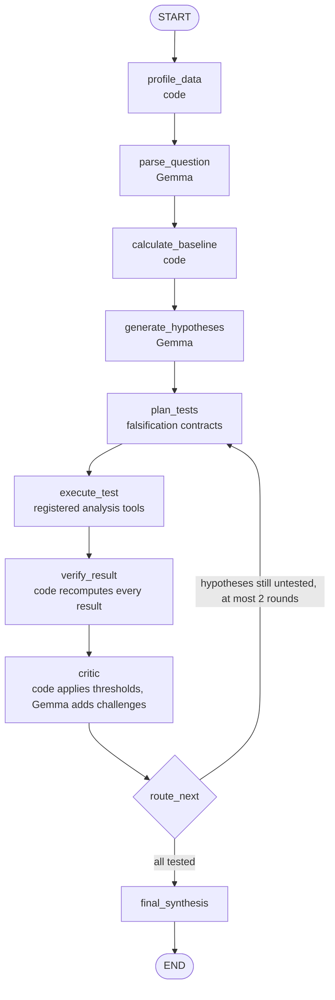

# Argue With My Data

> An AI data investigation agent that tries to falsify its own explanations before it answers. Upload a CSV, ask why a metric changed, and it tests competing explanations with deterministic calculations to show which ones the evidence supports, weakens, rejects or can't test.

## Team

**Team Name:** Training with Vibes


| Member                    | Contribution   |
| ------------------------- | -------------- |
| Krishav JS (Team Leader)  | TODO           |
| Pranav Senthil            | TODO           |
| Rahul Srinivasan          | TODO           |
| Mohal Raj                 | TODO           |


## Problem Statement

### The Problem

When a business metric changes, people ask "why?". AI data assistants are good at producing a plausible answer, such as "revenue fell because a major customer stopped ordering". A plausible answer isn't necessarily correct. A single dramatic event may account for only a small share of a change, while the real driver is spread thinly across the data. Analysts, managers and founders who act on the plausible answer can make the wrong decision.

### Why We Chose This Problem

- **AI answers can sound right without being right.** AI data tools are spreading fast, and they answer with the same confidence whether they're right or wrong. A convincing wrong explanation is worse than no answer, because people act on it. We wanted an AI analyst that has to doubt its own explanations.
- **The most obvious explanation is often wrong.** When a metric drops, people latch onto the most memorable event, like a large customer leaving, even when it accounts for only a small part of the change. We wanted a tool that measures how much each explanation actually accounts for.
- **People can't check how an AI reached its answer.** Most "chat with your data" tools give a final answer with no way to inspect the reasoning. We wanted every claim to be traceable to a specific test and calculation.
- **AI tools rarely admit what the data can't answer.** We wanted a system that can say an explanation is untestable, for example seasonality with only three months of data, instead of inventing an answer.

## Solution

Argue With My Data treats a "why" question as an investigation instead of a chat. It proposes several competing explanations, defines in advance how each one could be falsified, runs deterministic tests on the data, checks the calculations, has a critic challenge the results, and only then reports which explanations hold up. It also says when an explanation can't be tested with the data available.

### Key Features

- **Competing hypotheses:** several measurable explanations are tested, not just the first plausible one.
- **Falsification contracts:** each hypothesis gets a structured test with explicit, visible thresholds for support and rejection.
- **Deterministic evidence:** aggregations, percentages and contributions are calculated in code, never by the language model.
- **Four verdicts:** SUPPORTED, WEAKENED, REJECTED or UNTESTABLE, with an evidence trace (claim → test → calculation → result → verdict) for each.
- **Causality guardrail:** results are reported as contribution ("accounts for 40% of the decline"), not causation.

## Innovation and Differentiation

Most AI data tools follow CSV → LLM → answer. Argue With My Data puts an adversarial loop between the question and the answer: the model proposes explanations and tests, code computes the evidence, a verification step checks it, and a critic challenges the explanations before any conclusion is given. The system can weaken or reject its own first explanation, and can return UNTESTABLE instead of forcing an answer when the data is insufficient.

## Technical Implementation

### Architecture



Any node that reports an error ends the run with a clear message instead of continuing.

### Technology Stack


| Category        | Technologies                                                     |
| --------------- | ---------------------------------------------------------------- |
| Frontend        | Streamlit, Plotly                                                |
| Backend         | Python 3.11+, LangGraph, pandas, NumPy, DuckDB, Pydantic         |
| Database        | N/A                                                              |
| AI / ML         | Gemma 4 (`gemma-4-26b-a4b-it` by default) via LangChain (`langchain-google-genai`) |
| Infrastructure  | TODO: deployment                                                 |
| APIs / Services | Google Gemini API (serves the Gemma model)                       |


### How It Works

1. **Profile the data** (`analysis/profiling.py`): row count, data types, date columns, likely metrics and dimensions, missing values and date range.
2. **Parse the question** (`parse_question`): Gemma turns the question into a `QuestionPlan` (metric, date column, two periods, question type, candidate dimensions). Column names are checked against the data, and a requested month that isn't in the data is reported, never silently replaced.
3. **Calculate the baseline** (`calculate_baseline`): code computes both period totals, the absolute change and the percentage change.
4. **Generate hypotheses** (`generate_hypotheses`): Gemma proposes 3–5 explanations, each tied to one test: `contribution`, `mix`, `data_quality` or `trend`.
5. **Plan tests** (`plan_tests`): each hypothesis becomes a falsification contract with visible, test-specific thresholds:

   | Test | SUPPORTED | WEAKENED | REJECTED |
   |---|---|---|---|
   | contribution, mix | explains ≥ 50% of the change | ≥ 5% | < 5% |
   | data quality | ≥ 20% missing values or ≥ 10% duplicates | other material issues | < 5% missing, < 2% duplicates and no missing months |
   | trend (seasonality) | n/a | history available but not conclusive | **UNTESTABLE** with fewer than 24 months |

6. **Execute tests** (`execute_test`): every contract runs in one pass through the controlled registry in `tools/registry.py`. No model-generated code is executed.
7. **Verify** (`verify_result`): code recomputes the baseline and every test result independently. Any hypothesis whose evidence fails verification is reported as UNTESTABLE instead of evidence-backed.
8. **Critic** (`critic`): the verdict is computed in code from the contract's thresholds. Gemma then reviews the evidence as an adversarial critic; its challenge and any alternative explanation are attached as notes, but it can't change a verdict. Notes containing numbers or causal words ("caused", "proves") are discarded.
9. **Route** (`route_next`): if any hypothesis is still untested, the graph plans and runs tests again, for at most 2 rounds.
10. **Final synthesis** (`final_synthesis`): a report built from the verified verdicts. Gemma may only pick which SUPPORTED hypothesis to lead with. The report always ends by stating that the results show contribution and association, not causation.

If no `GEMMA_API_KEY` is set, or a Gemma call fails, each Gemma step falls back to a local, schema-validated rule: hypotheses are generated from the dataset's own columns, and verdicts are still computed from the data.

#### Demo result (verified)

Running "Why did revenue fall in March?" on the bundled `data/demo_sales.csv`, with the local fallback (no Gemma key), produces:

| Hypothesis | Test | Result | Verdict |
|---|---|---|---|
| Revenue change | baseline | ₹10,000,000 → ₹7,940,000 (−₹2,060,000, −20.6%) | — |
| A departing customer | contribution by customer | lost customers account for 8.0% of the change | WEAKENED |
| Product mix shift | mix by product | the unit-share shift accounts for 67.0% of the change | SUPPORTED |
| Regional decline | contribution by region | the largest region accounts for 14.0% of the change | WEAKENED |
| Data quality | data quality | 0% missing values, 0% duplicates, 0 missing months | REJECTED |
| Seasonality | trend | only 2 monthly periods available; 24 needed | UNTESTABLE |

All results passed verification. The demo dataset is synthetic and is regenerated by `data/generate_demo.py`.

### Technical Decisions

- **The language model never calculates.** Gemma parses, proposes and challenges; pandas and DuckDB compute every number.
- **Verdicts are applied in code** from thresholds fixed in each contract, so the model can't move the goalposts after seeing the results.
- **Verification gates every claim:** results are recomputed independently, and unverified evidence is reported as UNTESTABLE.
- **A controlled tool registry** (`tools/registry.py`) instead of model-generated code.
- **LangGraph owns the investigation state** and routing, with a hard limit of 2 test rounds and an early stop on errors.
- **All model output is validated** against Pydantic schemas (`models/schemas.py`) before it's used.
- **An offline fallback** keeps the app usable without an API key, and still computes verdicts from the data.

## Implementation During the Hackathon

The current codebase contains:

- the LangGraph investigation graph (`graph/`)
- the deterministic analysis tools (`analysis/`) and tool registry (`tools/`)
- the Gemma integration and its schema validation (`agents/llm.py`, `models/schemas.py`)
- the Streamlit interface (`app.py`, `ui/`)
- the synthetic demo dataset and its generator (`data/`)
- 9 automated tests (`tests/test_pipeline.py`)

TODO: add the team's account of who built what, and when, during the Hack Day.

### Team Contributions

- **Krishav JS (Team Leader):** TODO
- **Pranav Senthil:** TODO
- **Rahul Srinivasan:** TODO
- **Mohal Raj:** TODO

## Working Application

**Live Application:** TODO

TODO: how to access the deployed application and what can be tested.

## Demo Video

**Demo Video:** TODO

## Open Source and AI Usage

### AI / Models

- **Gemma 4 (Google),** default model `gemma-4-26b-a4b-it`, called through the Google Gemini API using `langchain-google-genai`. It parses the question, proposes hypotheses, reviews the evidence as a critic, and chooses which supported explanation to lead with. It doesn't compute numbers or assign verdicts. TODO: confirm a successful live run with Gemma before the demo.
- **AI coding assistants:** Claude Code (Anthropic, Claude Opus 5.5) was used for planning, repository setup and documentation. TODO: list every other AI tool the team used while coding.

### Open Source Components

- **LangGraph:** orchestration of the investigation state machine
- **LangChain (`langchain`, `langchain-google-genai`):** the connection to the Gemma model
- **pandas, NumPy:** data processing and calculations
- **DuckDB:** analytical queries in the comparison tools
- **Pydantic:** validation of structured model output
- **Streamlit:** user interface
- **Plotly:** charts
- **python-dotenv:** loading environment variables
- **Demo dataset:** synthetic, created by the team with `data/generate_demo.py`

TODO: licenses and attribution for each component.

## Setup and Usage

### Prerequisites

- Python 3.11+
- Optional: a Google AI Studio API key with access to a Gemma 4 model. Without it, the app runs with the local fallback.

### Installation

```bash
git clone https://github.com/whatsyourname909/hacktoberfest_-hack-day-coimbatore-x-init-club-and-idea-club.git
cd hacktoberfest_-hack-day-coimbatore-x-init-club-and-idea-club
python -m venv .venv
source .venv/bin/activate
pip install -r requirements.txt
```

### Environment Variables

```env
GEMMA_API_KEY=
GEMMA_MODEL=gemma-4-26b-a4b-it
```

Copy `.env.example` to `.env` and fill in your key. `.env` is listed in `.gitignore`; never commit it.

### Running the Project

```bash
streamlit run app.py
```

To run the tests:

```bash
python -m unittest discover -s tests -v
```

### Usage

1. In the sidebar, upload a CSV or choose **Try the demo dataset**. The sidebar shows the dataset profile.
2. Type a question, for example "Why did revenue fall in March?".
3. Click **Investigate**.
4. Read the baseline, the hypothesis table with verdicts, and the evidence for each hypothesis, then the final synthesis.

## Challenges and Learnings

TODO: complete at the end of the Hack Day.

## Devpost Submission

**Devpost Project:** TODO

## Credits and License

### Credits

LangGraph, LangChain, pandas, NumPy, DuckDB, Pydantic, Streamlit, Plotly, python-dotenv, and Google's Gemma models.

### License

TODO

## Submission Checklist

- [x] Project title and description added
- [x] All team members listed
- [x] Problem clearly explained
- [x] Reason for choosing the problem explained
- [x] Solution and key features documented
- [x] Innovation and differentiation explained
- [x] Architecture included
- [x] Technical implementation documented
- [ ] Work completed during the hackathon documented
- [ ] Team contributions documented
- [ ] Working application is functional
- [ ] Live application link added where applicable
- [ ] Demo video added
- [ ] AI and open-source components documented
- [ ] Setup and usage instructions tested
- [ ] Challenges and learnings documented
- [ ] Devpost submission completed
- [ ] Devpost link added
- [x] Credits added
- [ ] License added
- [ ] Repository is organized and complete
